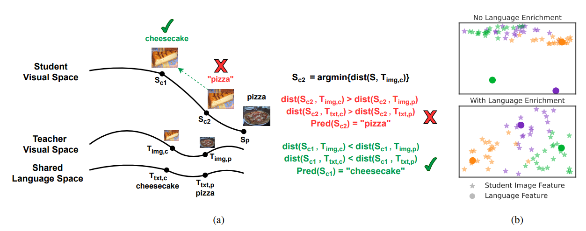

# Distilling Large Vision-Language Model With Out-of-Distribution Generalizability [ICCV 2023]

[paper](https://arxiv.org/pdf/2307.03135)

Large vision-language models have achieved outstanding performance, but their size and computational requirements make their deployment on resource-constrained devices and time-sensitive tasks impractical. In this paper, we investigate the distillation of visual representations in large teacher vision-language models into lightweight student models using a small- or mid-scale dataset, aiming to maintain the performance of teacher models. Notably, this study focuses on open-vocabulary out-of-distribution (OOD) generalization, a challenging problem that has been overlooked in previous model distillation literature. We propose two principles from vision and language modality perspectives to enhance student's OOD generalization: **(1)** by better imitating teacher's visual representation space, and carefully promoting better coherence in vision-language alignment with the teacher; **(2)** by enriching the teacher's language representations with informative and finegrained semantic attributes to effectively distinguish between different labels. We propose several metrics and conduct extensive experiments to investigate their techniques. The results demonstrate significant improvements in zero-shot and few-shot student performance on open-vocabulary out-of-distribution classification.



- [Distilling Large Vision-Language Model With Out-of-Distribution Generalizability](#distilling-large-vision-language-model-with-out-of-distribution-generalizability)
    - [Setup](#setup)
    - [Preparing main datasets](#preparing-main-datasets)
    - [Running main experiments](#running-main-experiments)
    - [Running robotics experiments](#running-robotics-experiments)
    - [Citations](#citations)
    - [License](#license)


### Setup

First create an anaconda environment:

`conda create -n large_vlm_distillation_ood python=3.8`

Then clone this repository and install it:

```
git clone https://github.com/xuanlinli17/large_vlm_distillation_ood
cd {path_to_this_repo}
pip install -e .
```

### Preparing main datasets

The main datasets can be downloaded using the scripts in `scripts/download_main_data.sh`. Please refer to the file for more details and read the file before downloading the datasets. For some datasets, you need to manually click through their websites and download them.

After downloading the datasets, for each dataset, make a directory through `mkdir {dataset_name}`, then enter the directory through `cd {dataset_name}` and extract the dataset files under this directory using `tar -xzvf {path_to_dataset_tar_file}`.

Then, for each dataset, split it into train, in-distribution validation ("val-on-train"), and out-of-distribution validation ("val") sets:

```
cd {path_to_this_repo}
python scripts/split_dataset.py --data-root {the directory you extracted the dataset} --dataset-name {dataset_name} 
```

Then, for each dataset, move the corresponding `label2text.txt` and the `chatgpt.txt` contained in this repo to the root path of dataset directory (**for "root path", ensure that there is a train folder and a val folder directly under it**):

```
cd {path_to_this_repo}
cp data/{dataset_name}/label2text.txt {dataset_root_path}/label2text.txt
cp data/{dataset_name}/chatgpt.txt {dataset_root_path}/chatgpt.txt
```

Optional: if you wish to use OFA-generated auxiliary captions for student training, you can download the features from `https://drive.google.com/drive/folders/11GmLM8raMyGr7q9glMiy9U3ENYZRQlbP?usp=sharing` and put them in the corresponding `/home/dataset_name/train` and `/home/dataset_name/val` directories. If you'd like to generate captions yourself, please install [OFA](https://github.com/OFA-Sys/OFA) first (to successfully install OFA, you might need to install an older setuptools package like `pip install setuptools==59.5.0`). After installing OFA, put `ofa_gen_captions.py` directly under the root directory of the OFA repo. You can then enter the OFA repo and use `ofa_gen_captions.py` to generate caption features.

Note: for the `label2text.txt` and `chatgpt.txt` files of tiered-ImageNet, since tiered-ImageNet is a subset of ImageNet, we generated these files to cover the entire set of 1000 classes in the ImageNet dataset, so these files can be extended to ImageNet as well.

### Running main experiments

To train a student, run the following command:

```
python main_experiments.py -d {path_to_dataset} \
    -a {student arch: e.g., resnet18 or vit_b_32} \
    --label-path {path_to_dataset's_label2text.txt} \
    --repeat-epochs {repeat_epochs} \
    {schedule_commands} \
    -c {save_path} \
    {batch_args} \
    {clip_model_args} \
    {loss_option_args}
```

where, for example,
- For ResNet students, `repeat_epochs` equals 5 for small datasets (Flowers, Cars, Birds), and 1 for larger datasets (Food, SUN, Tiered-ImageNet)
- For ViT students, `repeat_epochs` equals 5 for small datasets, and 3 for larger datasets
- `schedule_commands` equals `--epochs 90 --lr 0.05 --schedule 30 60 --gamma 0.1` for ResNet students and `--epochs 90 --repeat-epochs 3 --lr 0.0001 --onecyclelr --use-adam` for ViT students.
- `batch_args` equals `--train-batch 128 --test-batch 64`.
- `clip_model_args` equals `--use-clip --clip-model ViT-L/14`.
- `loss_option_args` can be any number of the following options:
  - adding `--clip-align-image-classification=1` enables `L-cls` (vision-language alignment loss for classification). Setting `--clip-align-image-classification=0` turns it off.
  - adding `--clip-align-image-mse` enables `L-mse` which naively matches teacher visual features
  - adding `--clip-align-image-contrastive` enables `L-cst`
  - adding `--clip-align-proximal-text-num=256` enables `L-vlalign` with `k=256`. Further adding `--clip-filter-out-wrong-alignment` enables the filtering out of images misaligned with language labels in `L-vlalign`.
  - adding `--chatgpt-raw-text-file {path to chatgpt.txt}` enables chatgpt-generated label descriptions
  - adding `--clip-align-image-aux-caption` enables auxiliary captions
  - adding `--prompt-learner` enables prompt learning through CoOp

To few-shot finetune a student, the commands are similar to the above, except that:
- Replace `schedule_commands` as `--epochs 20 --lr 0.001 --onecyclelr --gamma 0.1` for ResNet students and `--epochs 20 --repeat-epochs 3 --lr 0.0002 --onecyclelr --use-adam` for ViT students.
- Replace `-c` as `{previous_save_path}/fewshot5`
- Add these additional args: `--few-shot-num 5 --few-shot-method finetune`
- Add checkpoint to the args: `--resume {previous_save_path}/checkpoint.pth.tar`

A few more example commands are shown in `scripts/example_main_scripts.sh`.


### Running robotics experiments

You can download the robotic dataset at `https://drive.google.com/drive/folders/1SOUkoZ5ey0rBjQ37HdiiSQDGr5it2dh5?usp=sharing`

Example running scripts are in `scripts/example_robotics_scripts.sh`.

### Citations

Please cite our paper if you find our idea helpful. Thanks a lot!

```
@InProceedings{Li_2023_ICCV_Large_VLM_Distillation,
    author    = {Li, Xuanlin and Fang, Yunhao and Liu, Minghua and Ling, Zhan and Tu, Zhuowen and Su, Hao},
    title     = {Distilling Large Vision-Language Model with Out-of-Distribution Generalizability},
    booktitle = {Proceedings of the IEEE/CVF International Conference on Computer Vision (ICCV)},
    month     = {October},
    year      = {2023},
    pages     = {2492-2503}
}
```

### License

This project is licensed under the MIT license.
